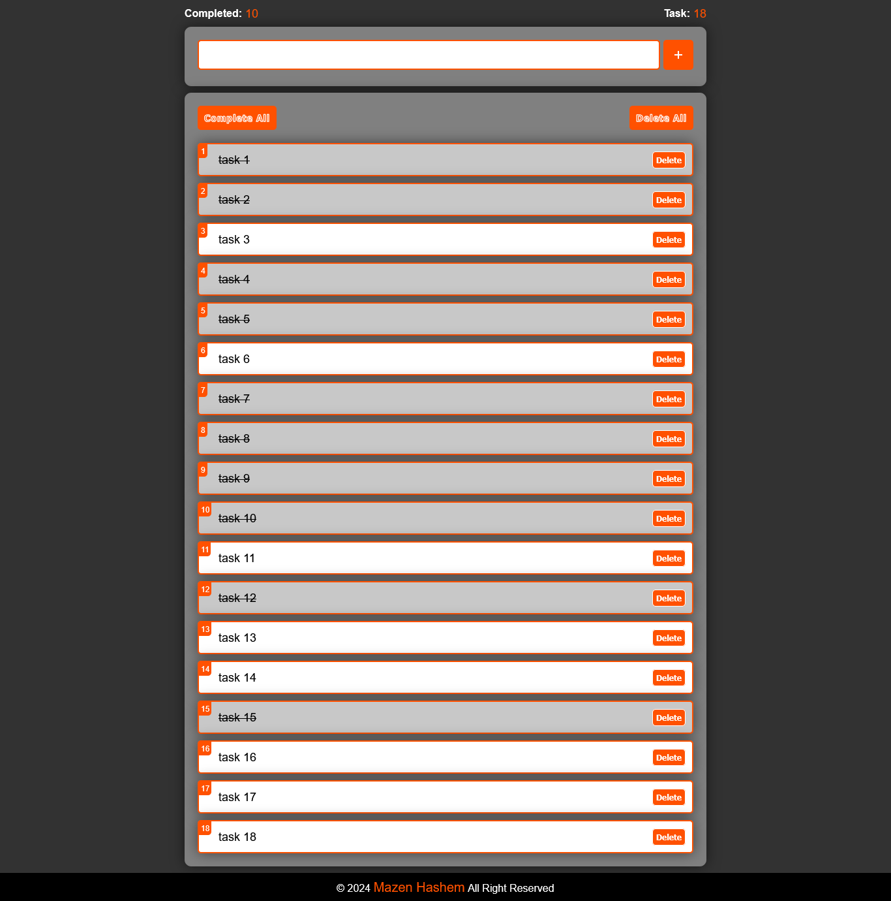

<h1>ToDo List App</h1>

  

<h2>Description</h2>

  This is a ToDo List App made by 
  <em>HTML</em> , 
  <em>CSS</em> and
  <em>JavaScript</em> languages.
  Inspired by 
  <strong>
    <a href="https://www.youtube.com/@ElzeroWebSchool">ElzeroWebSchool</a>
  </strong> 
  channel.

My goal from this project is to show my experience in Front-end web development.

<h3><u>Features:</u></h3>
<ul>
  <li>Total number of tasks.</li>
  <li>Total number of completed tasks.</li>
  <li>Numbering tasks.</li>
  <li>Can't add the same task twice as long as you didn't delete it, but you can know task current number by this.</li>
  <li>Click on the task to complete/uncomplete.</li>
  <li>Complete all button to complete all tasks.</li>
  <li>Click on the delete button to delete specific task.</li>
  <li>Delete all button to delete all tasks.</li>
  <li>Any change is adding to the local storage of your browser, so your tasks will be save in the app after refreshing or closing the app.</li>
</ul>

<h3><u>Responsiveness:</u></h3>

  The website is responsive, it created to use across all devices, such as modern desktops, tablets, and phone browsers.

<h2>Screenshot</h2>
